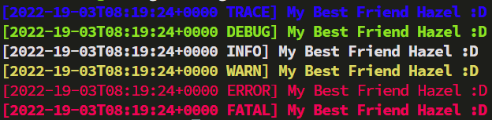

[](https://github.com/sgoudham/rall/actions/workflows/build.yml)
[](https://crates.io/crates/rall)
[](https://crates.io/crates/rall)
[](LICENSE)

# Really...? Another Logging Library?

**Yes! :P**

> rall is an incredibly simple and intuitive logger, consider this crate a _failure_ if you can't get setup within **30 seconds!**

## Feature Set

- [x] Logging Levels
- [x] Coloured Output
- [ ] Options for Datetime, Current Function, Line Number, Custom Colours, etc.
- [x] Custom Formatting
- [ ] File support

And much more to come... soon™!

## Quick Start

For the fastest setup possible, declarative macros are exposed that have a predefined format.
This is to allow hassle-free and painless setup that will let you log instantly!

```rust
use rall::{debug, error, fatal, info, trace, warn};

// Log Out To Standard Output
trace!("My Best Friend Hazel {}", ":D");
debug!("My Best Friend Hazel {}", ":D");
info!("My Best Friend Hazel {}", ":D");
warn!("My Best Friend Hazel {}", ":D");
error!("My Best Friend Hazel {}", ":D");
fatal!("My Best Friend Hazel {}", ":D");
```

### Windows Output


### Unix Output



### Author Notes

I'm still incredibly early in my Rust journey and so I wanted to get comfortable and try to pick my own brain about
exposing different API's in a Rust crate. I hope to expose an intuitive and easy to understand API design that users can
instantly get started with.